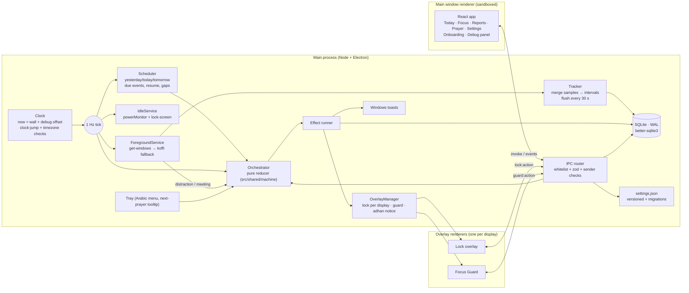
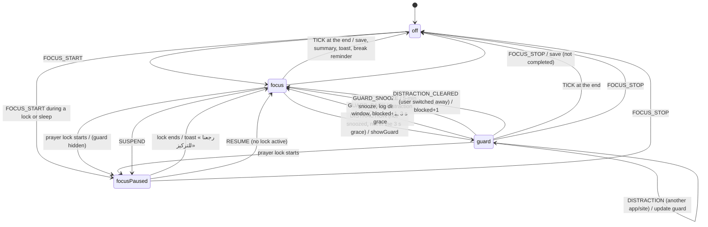
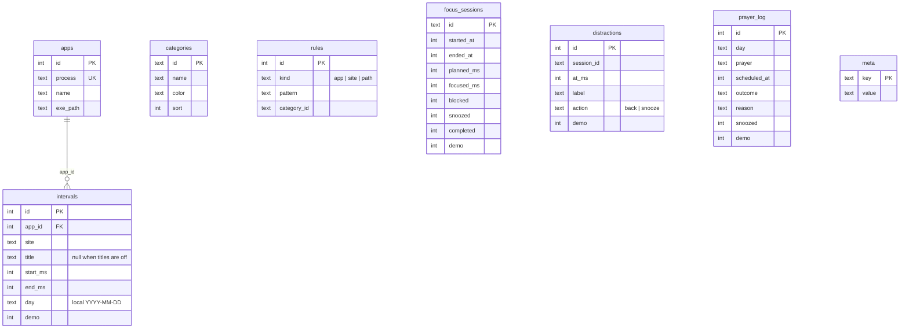
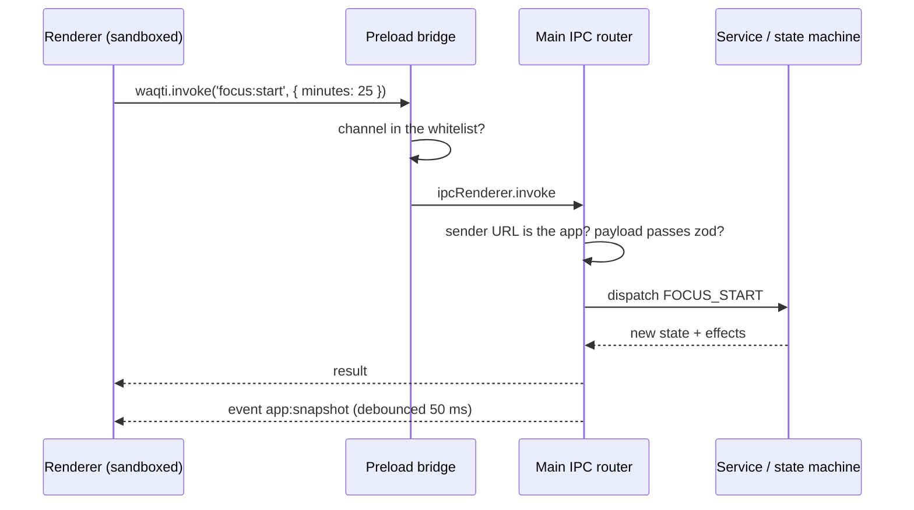

# Architecture — وقتي (Waqti)

Waqti is an offline Electron app. One **main process** owns everything that touches Windows (foreground window, idle state, overlays, the database, notifications, the tray). **Renderers** are sandboxed React views that talk to main only through a typed, validated IPC contract. All domain logic is pure TypeScript in `src/shared` and unit-tested.

## Processes and services

| Folder         | Contents                                                                                                                                                                                                                                                                                                                                                        |
| -------------- | --------------------------------------------------------------------------------------------------------------------------------------------------------------------------------------------------------------------------------------------------------------------------------------------------------------------------------------------------------------- |
| `src/shared`   | Pure logic: prayer schedule (`prayer/`), Arabic formatting (`format.ts`), strings (`strings.ts`), tracking rules (`tracking/`), the orchestrator (`machine/`), settings schema + migrations (`settings/`), sky palettes (`sky.ts`), Sky Arc geometry (`arc.ts`), chart palette (`palette.ts`), demo data (`demo/`), IPC contract (`ipc.ts`, `ipc-channels.ts`). |
| `src/main`     | `index.ts` (lifecycle), `core.ts` (wiring, tick, effects), `ipc.ts` (router), `services/` (clock, db, tracker, foreground, native (koffi), idle, scheduler, overlays, notifications, tray, apps/icons, exporter, analytics, settings store, meeting config, logger).                                                                                            |
| `src/preload`  | A 40-line bridge: `invoke(channel, payload)` and `on(event, cb)` for whitelisted names only.                                                                                                                                                                                                                                                                    |
| `src/renderer` | `index.html` (main window) and `overlay.html` (lock, guard and adhan-notice windows), React components, pages, design tokens, motion tokens.                                                                                                                                                                                                                    |

## The orchestrator state machine

`reduce(state, event, config) → { state, effects }` in `src/shared/machine/machine.ts` is pure and deterministic. The main process feeds it events (ticks, due prayers, power events, user actions) and executes the effects it returns. All deadlines (lock end, minimum unlock, snooze end, meeting re-check, focus end, guard snooze) live in the state and are checked on `TICK`, so sleep, clock changes and the debug clock offset all flow through the same path. An independent 60-minute safety timer in `OverlayManager` sends `FORCE_UNLOCK` if anything else ever fails.

The state has two parallel regions: **prayer** and **focus**.

### Adhan and iqama

A `PrayerRef` carries two times: `adhanAt`, the prayer's scheduled time, and `at`, when it locks: the adhan plus that prayer's delay (the iqama; 25/20/20/10/20 minutes by default, 20 for Fajr and 15 for Maghrib in Ramadan, 0 for Jumuah). `dueBetween` turns them into three events: `pre` (the reminder, before the adhan), `adhan` (the 10-second notice, left out when the lock itself comes with the adhan) and `prayer` (the lock). Everything that concerns the lock window — the away and meeting rules, the startup offer, missed prayers after sleep — counts from `at`; the log's `scheduledAt` and the "the adhan was N minutes ago" texts use `adhanAt`.

### Prayer region

```mermaid
stateDiagram-v2
  [*] --> idle
  idle --> reminding: PRE_REMINDER_DUE / toast «باقي ١٠ دقائق…»
  reminding --> idle: TICK (5 min after the lock time)
  idle --> idle: ADHAN_DUE / showAdhan (10 s notice; never over a lock or while asleep)
  idle --> idle: PRAYER_DUE, no lock (the adhan notice announced it)
  reminding --> idle: PRAYER_DUE, away (idle ≥ 5 min or screen locked) / log skipped:away
  idle --> idle: PRAYER_DUE, away / log skipped:away
  idle --> meetingDeferred: PRAYER_DUE, in a meeting / toast «أنت في اجتماع…»
  reminding --> meetingDeferred: PRAYER_DUE, in a meeting
  idle --> locked: PRAYER_DUE / showLock, pause focus
  reminding --> locked: PRAYER_DUE / showLock
  meetingDeferred --> meetingDeferred: TICK every 60 s, still in the meeting (< 30 min)
  meetingDeferred --> locked: meeting ended or 30 min passed, inside the lock window
  meetingDeferred --> idle: window already over / final reminder, log skipped:meeting
  idle --> offered: APP_STARTED ≤ 10 min after a lock time / clickable toast
  offered --> locked: OFFER_ACCEPTED (toast clicked)
  offered --> idle: TICK after the window / log skipped:late-start
  locked --> idle: PRAYED (after the minimum time) / log prayed, resume focus
  locked --> snoozed: SNOOZE (once per prayer) / hideLock
  snoozed --> locked: TICK after 5 min / showLock with the remaining time
  locked --> idle: EMERGENCY_EXIT (3 s hold) / log emergency
  locked --> idle: TICK at the end of the duration / log ended:duration
  locked --> idle: TICK at 60 min or FORCE_UNLOCK / log ended:safety
  locked --> locked: RESUME inside the window / re-show on every display
  locked --> idle: RESUME after the window / log ended
```

Other rules handled by the reducer:

- **Machine asleep at prayer time** — `RESUME` carries the prayers whose lock time passed while suspended: each lock-enabled one is logged `skipped:asleep`; if the latest was ≤ 20 minutes ago a short reminder toast is shown, otherwise nothing.
- **A new prayer while another is still active** (only possible with extreme settings) — the older one is closed (`superseded`) before the new one is handled.
- **App quit during a lock** — main keeps a `lock_active` marker in the database while a lock is shown; on the next start it is logged `ended:interrupted` and no overlay comes back.

### Focus region

Every transition above has a unit test in `src/shared/machine/machine.test.ts`.

## Tracking pipeline

1. Every second main reads the foreground window (process, exe path, title, window handle, bounds).
2. `normalizeForeground` identifies Store apps by title and friendly names from the exe's file description.
3. The tracker skips the sample when tracking is paused, the screen is locked, the user is idle ≥ the threshold (and trims the open interval back to the last input), Waqti's own overlay is visible, or the app is excluded.
4. `deriveSite` turns browser titles into a site (`… - YouTube - Google Chrome` → `youtube`).
5. `mergeStep` extends the open interval or closes it; closed intervals are split at local midnight and written in one transaction every 30 s (and on suspend/quit). The open interval is inserted once and then updated in place.
6. Categories are **applied at query time** (`categorize` with user rules → default rules), so re-categorising an app updates all history.

## Data model

Indexes: `intervals(day, app_id, site)`, `intervals(start_ms)`, unique `intervals(app_id, start_ms)`, `focus_sessions(started_at)`, `distractions(at_ms)`, unique `prayer_log(day, prayer)`. SQLite runs in WAL mode with `synchronous=NORMAL`; the schema version is `PRAGMA user_version`. At start `PRAGMA quick_check` runs; a damaged file is moved aside and the newest healthy daily backup (7 kept) is restored.

## IPC

- Channels and events are listed once in `src/shared/ipc-channels.ts` (no dependencies, so the sandboxed preload can import it). Request schemas and response types live in `src/shared/ipc.ts`.
- Lock actions are only accepted from lock windows, guard actions only from the guard window, and closing the adhan notice only from the notice window.
- `contextIsolation`, `sandbox`, no `nodeIntegration`, a strict CSP (`script-src 'self'`), navigation and `window.open` blocked, all permission requests denied.

## Windows and overlays

- **Main window** — frameless title bar with native caption buttons (`titleBarOverlay`) tinted to the current sky tone. Closing hides it to the tray (explained once with a toast); a window hidden for 60 s is destroyed to return its memory and recreated on demand.
- **Lock overlay** — one window per display at the `screen-saver` level, `skipTaskbar`, not closable by Alt+F4; displays added, removed or rescaled during a lock are reconciled. Only the primary display plays the chime.
- **Focus Guard** — one transparent, dimmed window on the display that holds the distracting window (bounds converted from physical pixels to DIP), shown without stealing focus.

## Timing and clock edge cases

| Situation                                  | Handling                                                                                          |
| ------------------------------------------ | ------------------------------------------------------------------------------------------------- |
| Midnight                                   | the scheduler rebuilds its three days when the local day changes; intervals are split at midnight |
| Sleep / resume                             | `powerMonitor` suspend/resume → tracker flush, `SUSPEND`/`RESUME` with missed prayers             |
| A tick gap > 5 min without a suspend event | treated like a resume                                                                             |
| Manual clock change                        | wall-vs-monotonic drift > 30 s → schedule rebuilt, skipped events not replayed                    |
| Timezone change                            | checked every minute (V8 re-detects the host zone) → schedule rebuilt                             |
| City / adjustments change                  | schedule rebuilt immediately                                                                      |
| Debug clock offset                         | same path as a clock change                                                                       |
