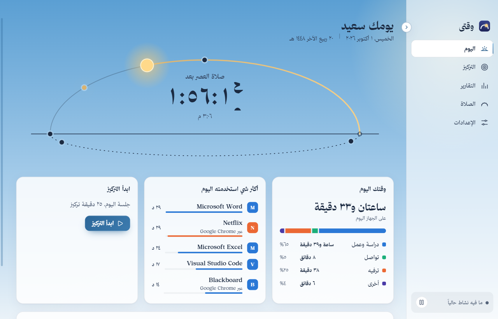
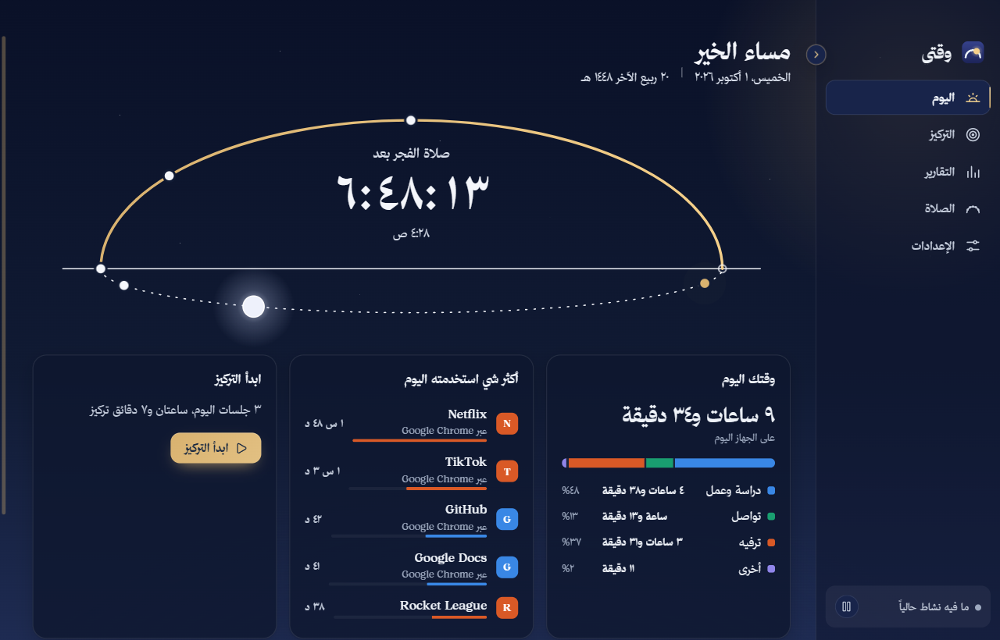
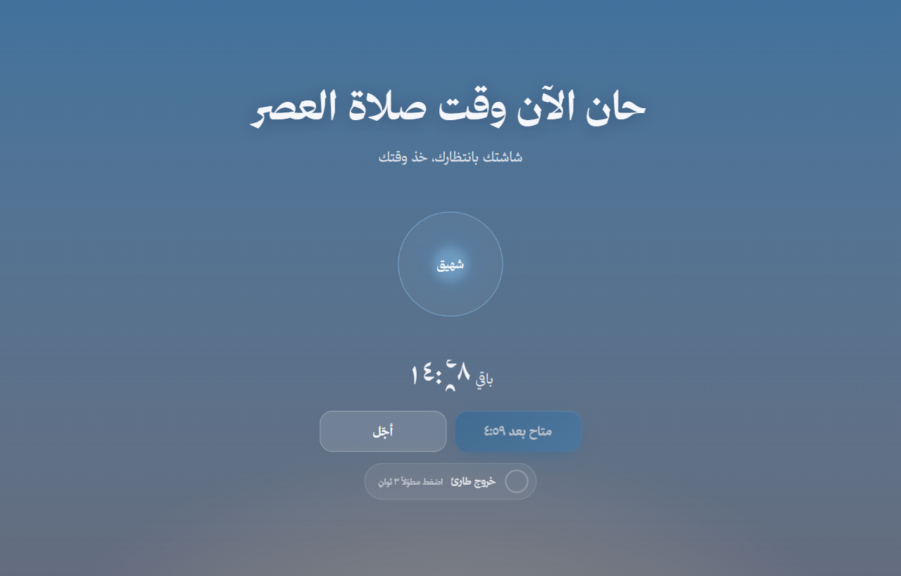
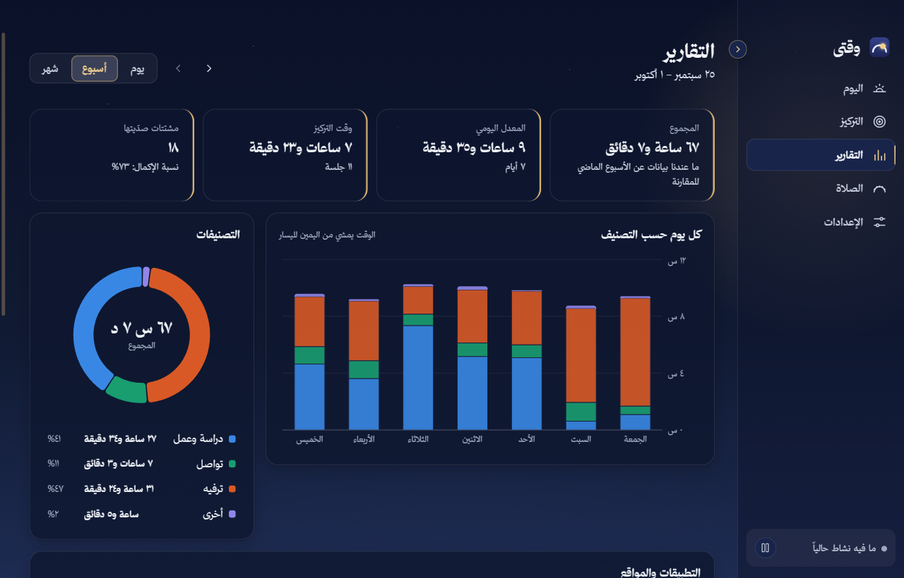
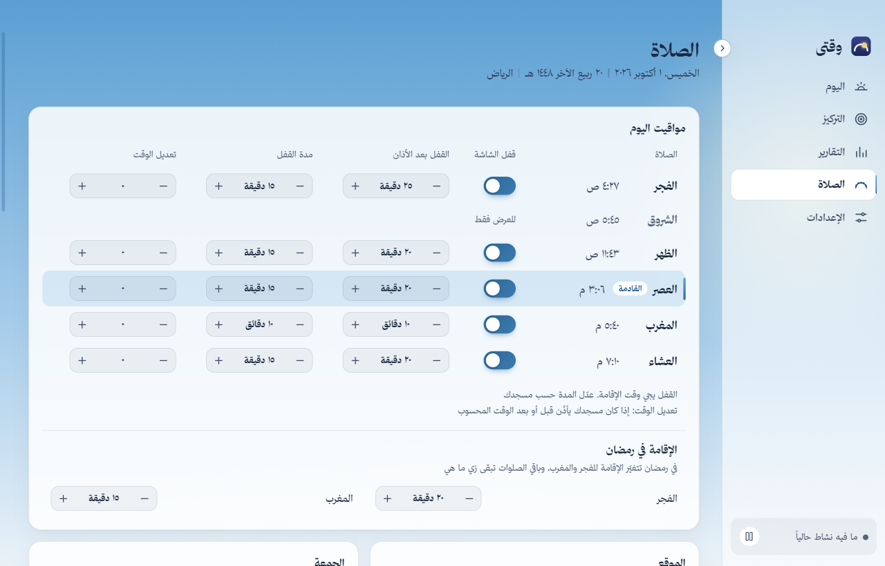
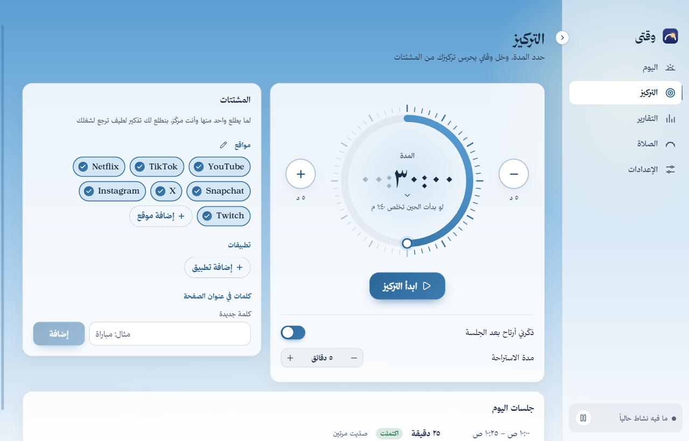
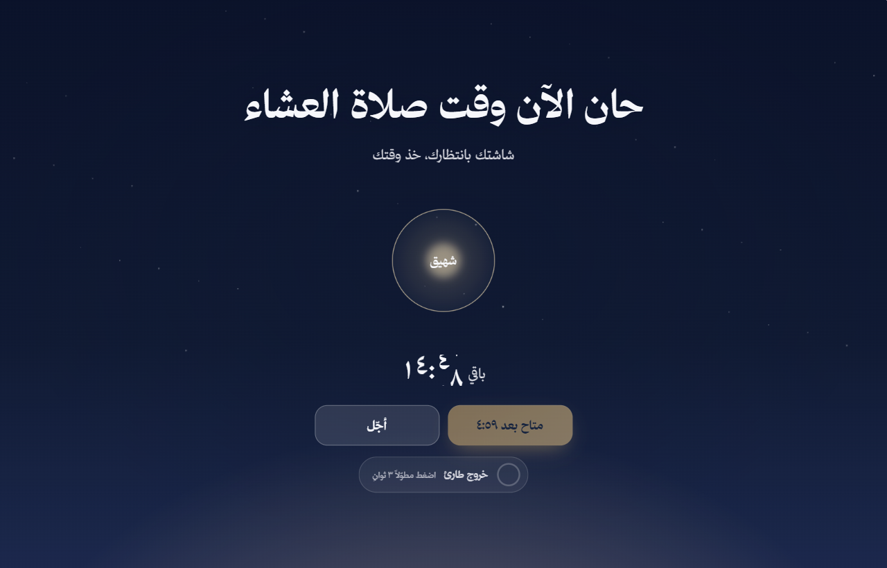

<div dir="rtl">

# وقتي

**وقتي يعرف وين يروح وقتك على الكمبيوتر، يساعدك تركّز، ويوقف كل شي وقت الصلاة.**

تطبيق لويندوز ١٠ و١١، بالعربي بالكامل، يشتغل بدون إنترنت، وكل بياناتك تبقى على جهازك.



## ليش وقتي؟

كثير منا طلاب وموظفين نقعد ساعات على الكمبيوتر، ونكتشف آخر اليوم إن نصه راح بين يوتيوب ووسائل التواصل، أو إن الصلاة دخلت ونحن مندمجين. وقتي يحل الثلاث مشاكل مع بعض:

- **يعرف وين يروح وقتك:** يسجّل تلقائياً التطبيقات والمواقع اللي تستخدمها، ويصنّفها (دراسة وعمل، تواصل، ترفيه، أخرى)، ويعطيك تقارير يومية وأسبوعية وشهرية.
- **يساعدك تركّز:** جلسات تركيز بأي مدة تختارها من ساعة مثل مؤقت المطبخ. لو فتحت تطبيق أو موقع يشتتك، يطلع لك تذكير لطيف ترجع لشغلك.
- **يوقف كل شي وقت الصلاة:** بتقويم أم القرى. يذكّرك قبل الأذان، ووقت الأذان يجيك تنبيه قصير، ووقت الإقامة تنقفل الشاشة بهدوء على كل الشاشات ويوقف الفيديو والصوت الشغّال، مع دائرة تنفّس والوقت المتبقي. وتقدر تطلع متى ما احتجت.

## المميزات

- مواقيت أم القرى لـ ١٩ مدينة سعودية أو أي إحداثيات، مع تعديل دقائق لكل صلاة، وإضافة ٣٠ دقيقة للعشاء في رمضان، وإعدادات خاصة للجمعة.
- القفل وقت الإقامة: تحدد المدة بين الأذان والإقامة لكل صلاة (الافتراضي: الفجر ٢٥، الظهر والعصر والعشاء ٢٠، المغرب ١٠ دقائق)، وللفجر والمغرب قيم خاصة في رمضان.
- قفل ذكي: ما يقفل إذا كنت بعيد عن الجهاز (وإذا فيه فيديو أو صوت شغّال يعتبرك موجود)، ويأجّل إذا كنت في اجتماع (Teams وZoom وWebex وGoogle Meet وعرض PowerPoint)، ويذكّرك إذا صحّى الجهاز من النوم بعد الأذان.
- زر «صلّيت» بعد وقت أدنى، وتأجيل مرة وحدة تختار مدته من شاشة القفل (من دقيقة إلى ١٥، وتقدر تطفيه)، وخروج طارئ بالضغط المطوّل (٣ إلى ١٠ ثواني حسب إعدادك).
- وقت القفل يوقف كل الفيديوهات والأصوات الشغّالة ويكتم الصوت، ويرجّع الصوت زي ما كان إذا انتهى القفل أو أجّلته أو خرجت.
- التركيز: ساعة تسحب حلقتها مثل مؤقت المطبخ (كل لفّة ساعة)، أو − و + بخمس دقائق (اضغط مطوّل وتسرع)، أو تضغط على الوقت `٠٠:٣٠:٠٠` وتختار الساعات والدقائق والثواني من قائمة. تبدأ بـ ٣٠ دقيقة، وتتذكّر آخر مدة.
- أثناء الجلسة: − و + يقدّمون نهايتها أو يأخرونها، وأيقونة وقتي في شريط المهام تتعبّى مع الجلسة.
- إذا كانت صلاة بتجي في نص الجلسة يقولك، ويعطيك زر «خلها تخلص مع أذان …».
- المشتتات شرائح تشغّلها وتطفيها بضغطة (المواقع والتطبيقات والكلمات)، والقلم جنب العنوان يحذف أي وحدة منها، حتى يوتيوب وسناب. تضيف أي تطبيق أو موقع، ويقولك «تمت الإضافة» أو «في القائمة من قبل» بدون ما تطلع من النافذة.
- تصميم «سماء اليوم»: ألوان التطبيق تتبع وقت اليوم من الفجر لليل، حتى الأزرار والمفاتيح والشرائح ورموز القائمة وشاشة القفل (ذهبي بالليل، وردي وقت الفجر والمغرب، أزرق بالنهار، كهرماني وقت العصر)، وقوس في صفحة اليوم فيه الشمس والقمر ومواقيت الصلاة.
- القائمة الجانبية تنطوي لشريط رموز (الزر على طرفها أو Ctrl+B)، ويبقى فيها اللوغو ومفتاح التتبع مع لمبته: خضراء وقت التتبع وحمراء إذا وقّفته.
- لوغو واحد في كل مكان: الأيقونة في شريط المهام، والاختصار، وجنب الساعة، وداخل التطبيق.
- عربي وإنجليزي: تختار اللغة وقت التثبيت أو في أول شاشة، وتقدر تغيّرها من الإعدادات. مع الإنجليزي ينقلب التطبيق كله من اليسار لليمين (القائمة، الرسوم، قوس السماء، شاشة القفل).
- خصوصية كاملة: إيقاف التتبع، استثناء تطبيقات، عدم حفظ عناوين النوافذ، مدة احتفاظ، تصدير (JSON وCSV)، وحذف كل شي.

<table>
<tr>
<td></td>
<td></td>
</tr>
<tr>
<td></td>
<td></td>
</tr>
<tr>
<td></td>
<td></td>
</tr>
</table>

## التثبيت

١. نزّل `Waqti-Setup-1.0.0.exe` من صفحة الإصدارات (Releases).

٢. شغّله. أول شي يسألك عن اللغة (العربية أو English)، والتطبيق يفتح بنفس اللغة. المثبّت **غير موقّع رقمياً**، فويندوز بيعرض رسالة «Windows protected your PC» (SmartScreen). اضغط **More info (مزيد من المعلومات)** ثم **Run anyway (تشغيل على أي حال)**.

٣. التثبيت للمستخدم الحالي فقط (ما يحتاج صلاحيات مدير)، ويضيف اختصار على سطح المكتب وفي قائمة ابدأ.

٤. أول تشغيل يمشي معك ٥ خطوات: الترحيب (وفيه اختيار اللغة)، مدينتك، قفل الصلاة، المشتتات، والتشغيل مع ويندوز.

**إلغاء التثبيت:** من إعدادات ويندوز ← التطبيقات. بيسألك إذا تبي تحذف بياناتك أو تحتفظ فيها.

## الاستخدام

- **اليوم:** وقتك اليوم حسب التصنيف، أكثر التطبيقات، وشريط يومك ساعة بساعة، والعد التنازلي للصلاة الجاية.
- **التركيز:** حدد المدة (اسحب الحلقة، أو − و +، أو اضغط على الوقت) واضغط «ابدأ التركيز». شغّل أو طفّ المشتتات من شرائحها، والقلم جنب «مواقع» أو «تطبيقات» يحذف.
- **التقارير:** يوم / أسبوع / شهر، مع مقارنة بالفترة السابقة. اضغط على تصنيف أي تطبيق لتغييره، والتغيير يطبق على كل السجل.
- **الصلاة:** المواقيت، القفل ومدته لكل صلاة، التعديل، الجمعة، التذكير، القواعد الذكية، وسجل الأسبوع.
- **الإعدادات:** الأرقام (٠١٢ أو 012)، نظام الساعة، السمة، تقليل الحركة، الخصوصية، التصنيفات، والبيانات.
- وقتي يشتغل من الأيقونة جنب الساعة. إغلاق النافذة ما يوقفه.

## للمطوّرين

المتطلبات: Node.js 22.12 أو أحدث على ويندوز x64. ما تحتاج أدوات بناء C++ لأن كل المكتبات الأصلية جاهزة.

```bash
npm install
npm run dev
```

**الخط:** الواجهة بخط ثمانية: Serif Display للعناوين والأرقام الكبيرة، وSerif Text لباقي النصوص. ترخيصه يمنع إعادة توزيع ملفاته، فهي مو موجودة في المستودع. نزّله من [font.thmanyah.com](https://font.thmanyah.com) لمجلد التنزيلات، وبعدين شغّل `npm run fonts` مرة وحدة. بدونه يشتغل التطبيق بالخطوط الاحتياطية، لكن `npm run dist` يرفض يبني المثبّت.

| الأمر                                | الوظيفة                                    |
| ------------------------------------ | ------------------------------------------ |
| `npm run dev`                        | تشغيل التطبيق للتطوير                      |
| `npm run build`                      | بناء نسخة الإنتاج في `out/`                |
| `npm run dist`                       | بناء المثبّت: `dist/Waqti-Setup-1.0.0.exe` |
| `npm run typecheck` / `npm run lint` | فحص الأنواع والتنسيق                       |
| `npm test`                           | اختبارات الوحدات مع التغطية                |
| `npm run test:e2e`                   | اختبارات التطبيق الكامل (Playwright)       |

الملفات المهمة: [ARCHITECTURE.md](ARCHITECTURE.md) (هيكل التطبيق)، [DECISIONS.md](DECISIONS.md) (قرارات التصميم بالعربي)، [TESTING.md](TESTING.md) (دليل الاختبار اليدوي)، [PROGRESS.md](PROGRESS.md) (سجل العمل والأداء).

## قيود معروفة (بصراحة)

- **إيقاف الفيديو والصوت وقت القفل** يشتغل مع البرامج اللي تسجّل نفسها عند ويندوز (المتصفحات ومشغّل الوسائط وغيرها). البرامج اللي ما تسجّل (مثل VLC 3) تكمل، وشاشة القفل تغطيها.
- **الذاكرة والنافذة مفتوحة:** حوالي ٢٩٠ ميجا على صفحة اليوم (نافذة Electron الفاضية لحالها ١٣٣ ميجا). في الخلفية وهو الاستخدام المعتاد: حوالي ١٤٠ ميجا. التفاصيل في PROGRESS.md.
- **المثبّت غير موقّع**، فيطلع تحذير SmartScreen أول مرة.
- **ويندوز فقط.** الكود ما ينهار على الأنظمة الثانية، لكن التتبع والقفل مصممين لويندوز.
- **ما يعرف الموقع داخل المتصفح إلا من عنوان النافذة.** إذا كان عنوان الصفحة ما يذكر الموقع، ينحسب الوقت للمتصفح نفسه.
- **الاجتماع يُعرف من التطبيق اللي في الواجهة فقط.** لو كنت في اجتماع Teams والنافذة في الخلفية، ما يعتبره اجتماع. القائمة قابلة للتعديل في `%APPDATA%\Waqti\meeting-apps.json`.

## الترخيص

MIT — انظر [LICENSE](LICENSE). خط الواجهة «خط ثمانية» © ثمانية للنشر والتوزيع، مستخدم حسب [ترخيص خط ثمانية](https://font.thmanyah.com/licenses)، وهو مضمّن داخل التطبيق ومو مرخّص لاستخراجه أو إعادة توزيعه. الخطوط الاحتياطية (Noto Kufi Arabic وIBM Plex Sans Arabic) بترخيص SIL OFL 1.1، وتراخيص كل المكتبات في [THIRD_PARTY_LICENSES](THIRD_PARTY_LICENSES).

</div>

---

# Waqti (English)

**Waqti knows where your computer time goes, helps you focus, and pauses everything at prayer time.**

A Windows 10/11 desktop app in Arabic (right to left) and English (left to right). It works completely offline and keeps every byte of data on your machine.

<table>
<tr>
<td></td>
<td></td>
</tr>
</table>

## Why it exists

Students and office workers in Saudi Arabia spend hours a day on a PC. Waqti answers three questions in one place: where did my time go, how do I stay focused, and how do I make sure work never runs over a prayer.

## What it does

- **Automatic time tracking** — the foreground app is sampled once a second, merged into intervals, and grouped into categories (study & work, communication, entertainment, other, plus your own). Browser sites (YouTube, Netflix, …) are recognised from window titles. Re-categorising an app updates all history because rules are applied at query time.
- **Focus sessions** — any length up to 23:59:59 on a kitchen-timer dial (drag the ring, one turn an hour; − / + by five minutes, hold to repeat; or pick hours, minutes and seconds from the clock face). 30 minutes at first, then the last length. During a session − / + move its end and the taskbar button fills with it. A prayer that would fall inside the session is announced, with a one-click length that ends at its adhan. Distractions are on/off chips (edit mode removes the added ones). Distractions are apps, known sites, any other site by name, and title keywords. If a distracting app or site comes to the foreground, a dimmed Focus Guard asks you to get back to work (it can minimise the distracting window) or allows a recorded 5-minute snooze. Sessions pause for prayer and end with a short summary.
- **Prayer reminders and lock** — Umm al-Qura times (Shafi Asr, +30 min Isha in Ramadan, Friday handled as Jumuah, ±15 min per-prayer adjustment) for 19 Saudi cities or custom coordinates. A toast before each adhan, a 10-second notice at the adhan, and at the iqama — a per-prayer delay after the adhan (Fajr 25, Dhuhr/Asr/Isha 20, Maghrib 10 minutes by default, with Ramadan values for Fajr and Maghrib; Jumuah locks with its adhan) — a calm full-screen lock on every display with a breathing circle and the time remaining, which also pauses any video or audio that is playing. "صلّيت" unlocks after a minimum time; one snooze whose length (1–15 minutes) is chosen on the lock screen and which can be turned off; and a press-and-hold emergency exit (3–10 seconds) that is always available. The sound is muted while locked and restored exactly afterwards. It never locks when you are away (no input for 5 minutes and nothing playing, or Windows locked), defers during meetings (Teams, Zoom, Webex, Google Meet, PowerPoint slideshows), reminds you after waking from sleep, and has a hard 60-minute safety limit.
- **Arabic and English** — chosen in the installer or on the first screen, and changeable in Settings. English turns the whole app left to right (sidebar, charts, the Sky Arc, the lock screen); numbers, dates, plurals and durations follow the language.
- **Reports** — day/week/month with stacked bars (time flows in the reading direction), a category donut, top apps and sites, focus statistics and a comparison with the previous period.
- **Privacy** — pause tracking, exclude apps, don't store window titles, retention (30/90/365 days or forever), JSON/CSV export, JSON import, delete everything.

## Install

1. Download `Waqti-Setup-1.0.0.exe` from Releases and run it. It first asks for a language (Arabic or English); Waqti opens in that language.
2. The installer is **not code-signed**, so Windows SmartScreen shows "Windows protected your PC". Click **More info**, then **Run anyway**.
3. It installs per-user (no admin rights), with desktop and Start menu shortcuts. The uninstaller asks whether to keep your data.

## Build from source

Requirements: Node.js ≥ 22.12 on Windows x64. No C++ toolchain is needed — every native module ships an N-API prebuild.

```bash
npm install
npm run dev
```

**Font:** the interface uses the thmanyah typeface: Serif Display for headings and big numbers, Serif Text for everything else. Its licence forbids redistributing the font files, so they are not in the repository: download the family from [font.thmanyah.com](https://font.thmanyah.com) into your Downloads folder and run `npm run fonts` once (or `npm run fonts -- path/to/Thmanyah-Font-Family.zip`). The build inlines the fonts into the CSS bundle, so they never ship as separate files. Without them the app runs on the bundled fallback fonts, and `npm run dist` refuses to build.

`npm run dist` builds the installer at `dist/Waqti-Setup-1.0.0.exe`. Other scripts: `typecheck`, `lint`, `test` (Vitest with a coverage gate), `test:e2e` (Playwright driving the real Electron app), `bench`, `perf`, `screenshots`.

Documentation: [ARCHITECTURE.md](ARCHITECTURE.md) (processes, the lock/focus state machine with Mermaid diagrams, data model), [DECISIONS.md](DECISIONS.md) (design decisions, in Arabic), [TESTING.md](TESTING.md) (manual test checklist, in Arabic), [PROGRESS.md](PROGRESS.md) (build log and measured performance).

## Honest limitations

- **Media pause at the lock covers apps that report to Windows' media controls** (browsers, Media Player and others). It pauses only sessions that are playing, through the official Global System Media Transport Controls (WinRT called with koffi in a separate utility process) — never blind media keys. Apps that don't report (e.g. VLC 3) keep playing behind the lock.
- **Memory with the window open** is ~290 MB on the Today screen (an empty Electron window alone uses 133 MB). In typical use Waqti lives in the tray, releases its window after 60 seconds, and idles at ~140 MB with ~0 % CPU.
- **Unsigned installer** — SmartScreen warns on first run.
- **Windows only.** The code does not crash elsewhere, but tracking and the lock are built for Windows.
- **Sites are derived from window titles**; pages whose titles don't name the site count towards the browser.
- **Meetings are detected from the foreground window**; the list lives in `%APPDATA%\Waqti\meeting-apps.json` and can be edited.

## License

MIT — see [LICENSE](LICENSE). The interface fonts, Thmanyah Serif Display and Serif Text, are © thmanyah Publishing and Distribution and used under the [thmanyah Font License](https://font.thmanyah.com/licenses); it is embedded in the application and is not licensed for extraction or redistribution. The fallback fonts (Noto Kufi Arabic, IBM Plex Sans Arabic) are under the SIL Open Font License 1.1; all third-party licences are in [THIRD_PARTY_LICENSES](THIRD_PARTY_LICENSES).
