<div dir="rtl">

<p align="center">
  
</p>

<h1 align="center">وقتي</h1>

<p align="center">
  <b>يعرف وين يروح وقتك على الكمبيوتر، يساعدك تركّز، ويوقف كل شي وقت الصلاة.</b>
  <br />
  تطبيق لويندوز ١٠ و١١، بالعربي والإنجليزي، يشتغل بدون إنترنت، وبياناتك ما تطلع من جهازك.
</p>

<p align="center">
  <a href="https://github.com/Abdulaziz-J1/waqti/releases/latest"><b>تحميل وقتي</b></a>
  &nbsp;·&nbsp;
  <a href="#waqti-english">English</a>
</p>

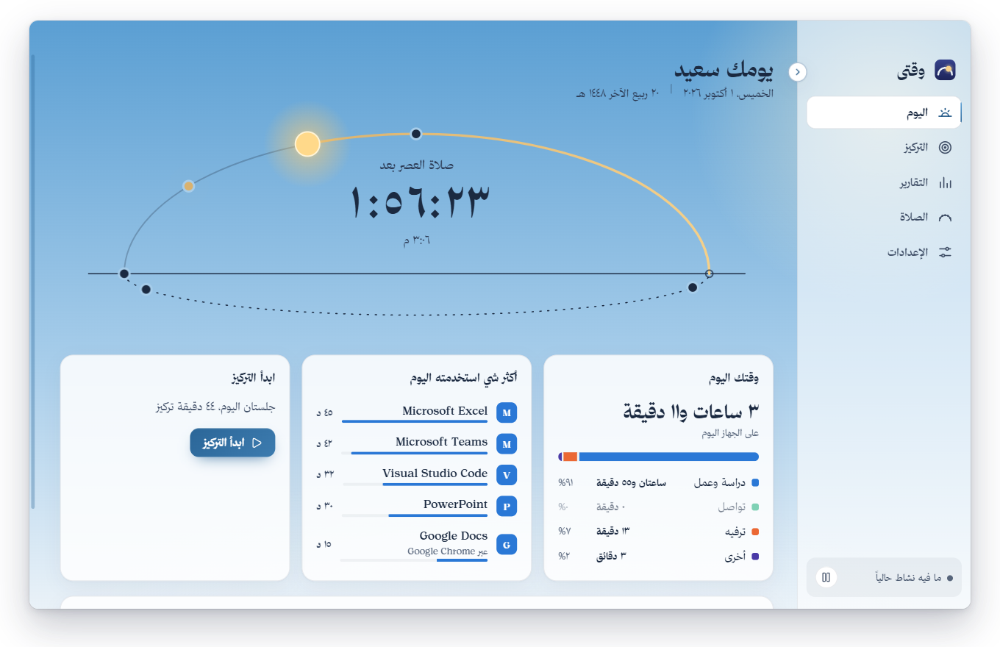

## ليش سويته

كثير منا صار يومه كله على الجهاز، إما شغل أو لعب، وتدخل الصلاة وتطوف وهو ما درى عنها. وآخر اليوم ما يعرف وين راح وقته أصلاً.

سويت وقتي عشان يكون معك وأنت على الجهاز: ينبهك وقت الأذان، ويوقف كل شي وقت الإقامة لين تصلي، ويوريك بوضوح وين راح يومك، ويساعدك تركّز على اللي يهمك. كله بالعربي، وبدون حساب ولا إنترنت.

## الصلاة قبل كل شي

وقت الأذان يطلع لك تنبيه صغير يقولك بعد كم بتنقفل الشاشة. ووقت الإقامة تنقفل الشاشة بهدوء على كل الشاشات، ويوقف الفيديو والصوت الشغّال، مع دائرة تنفّس والوقت المتبقي. زر «صلّيت» يفتح بعد دقايق، وفيه تأجيل مرة وحدة وخروج طارئ بالضغط المطوّل، فما تحس إنك محبوس.

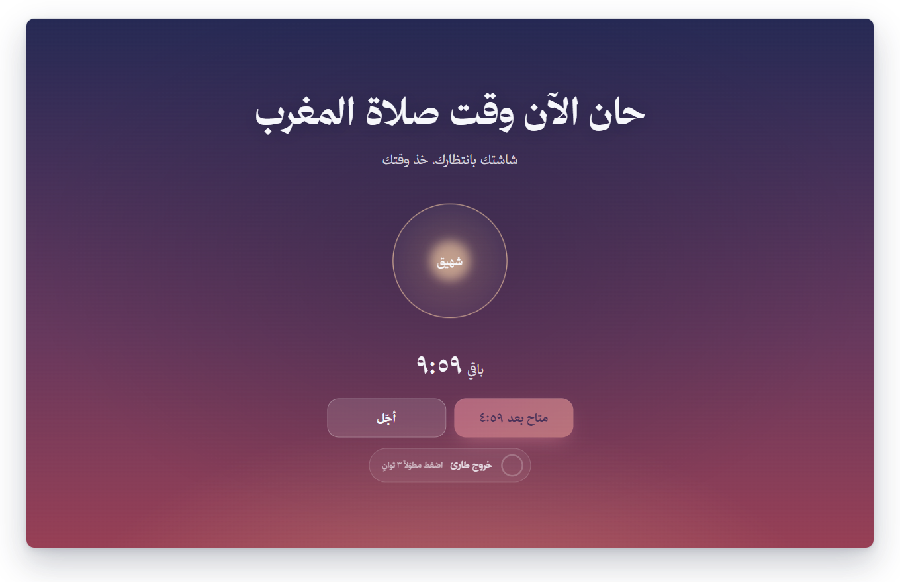

<table>
<tr>
<td width="50%">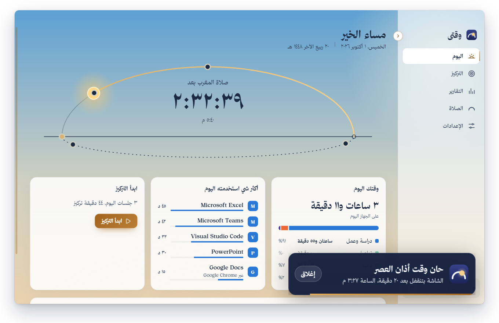</td>
<td width="50%">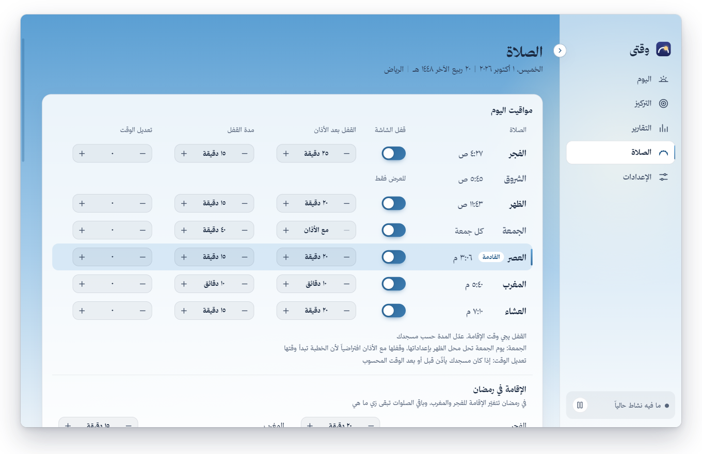</td>
</tr>
</table>

- مواقيت أم القرى لـ ١٩ مدينة سعودية أو أي إحداثيات، وتعدّل وقت كل صلاة بالدقائق إذا مسجدك يختلف.
- لكل صلاة تحدد متى تنقفل بعد الأذان وكم مدة القفل، والجمعة لها صفها وإعداداتها، ورمضان له إقامته.
- ما يقفل إذا كنت بعيد عن الجهاز، ويتأجّل إذا كنت في اجتماع (Teams وZoom وGoogle Meet وغيرها).
- يكتم الصوت وقت القفل ويرجّعه زي ما كان، وفيه تنبيه قبل الشروق إن وقت الفجر بيخلص.

## اعرف وين راح يومك

وقتي يسجّل التطبيقات والمواقع اللي تستخدمها تلقائياً ويصنّفها: دراسة وعمل، تواصل، ترفيه. تشوف يومك وأسبوعك وشهرك، ومقارنة بالفترة اللي قبلها، وكم مرة صدّيت عن المشتتات. وإذا صنّف تطبيق غلط، تغيّره بضغطة ويتعدّل السجل كله.

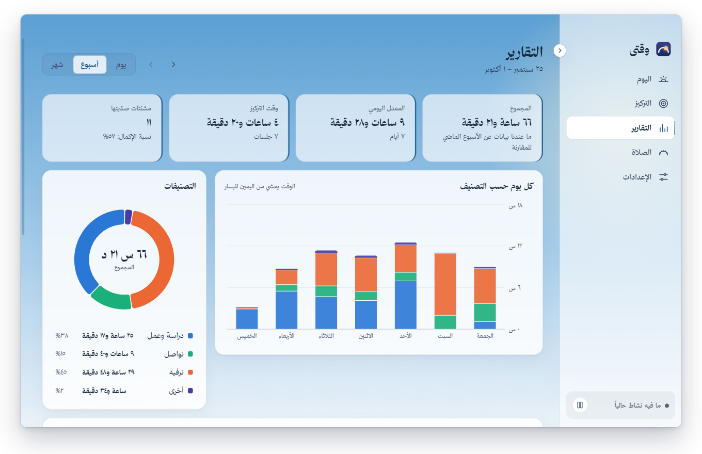

## ركّز، ووقتي يحرسك

تختار المدة من ساعة تسحبها مثل مؤقت المطبخ، وتحدد وش يشتتك: يوتيوب، تيك توك، أي موقع أو تطبيق، أو كلمة في عنوان الصفحة. إذا فتحت واحد منها وأنت في جلسة، يطلع لك تذكير لطيف ترجع لشغلك. وإذا الصلاة بتدخل في نص الجلسة، يقولك من البداية ويعطيك خيار تخلص الجلسة مع الأذان.

<table>
<tr>
<td width="50%">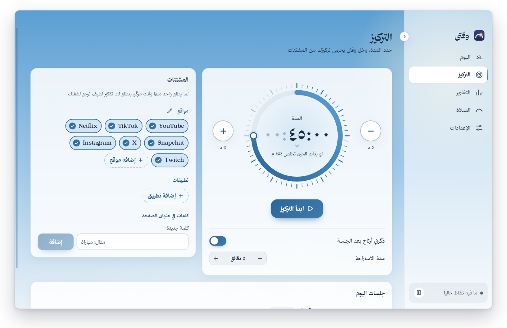</td>
<td width="50%">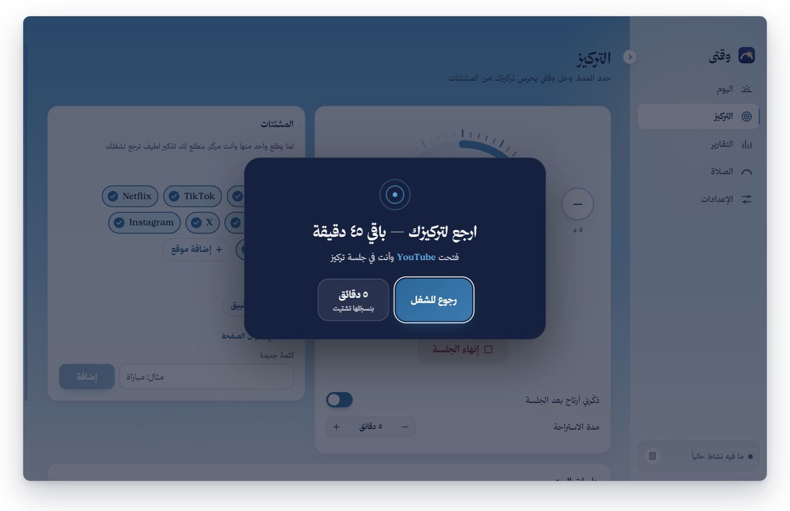</td>
</tr>
</table>

## يتلوّن مع سماء يومك

ألوان التطبيق تمشي مع وقت اليوم: أزرق بالنهار، كهرماني وقت العصر، وردي وقت المغرب، وذهبي بالليل. حتى شاشة القفل والتنبيهات تاخذ لون وقتها.

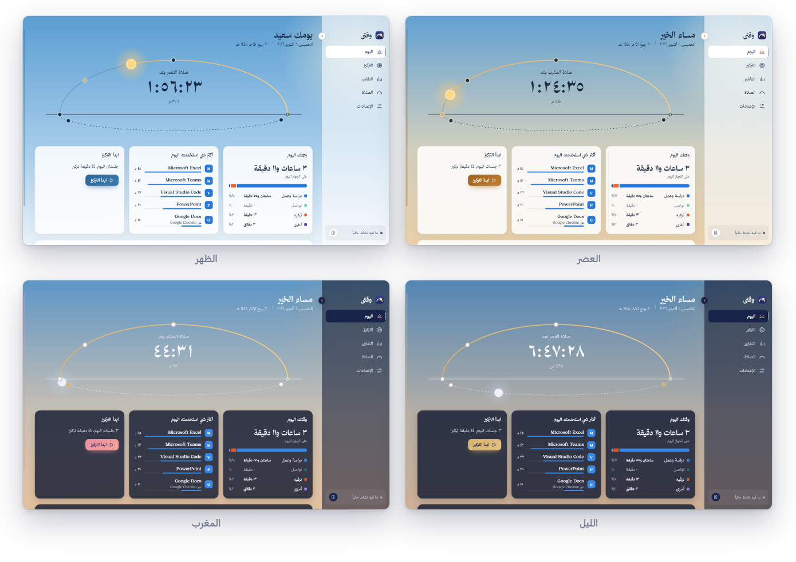

## خصوصيتك لك

ما فيه حساب ولا إنترنت، وما يطلع أي شي من جهازك. تقدر توقف التتبع، وتستثني تطبيقات، وتمنعه من حفظ عناوين النوافذ، وتحدد كم يحتفظ بالبيانات، وتصدّرها (JSON وCSV)، أو تحذف كل شي.

## التحميل والتثبيت

١. نزّل `Waqti-Setup.exe` من [صفحة الإصدارات](https://github.com/Abdulaziz-J1/waqti/releases/latest).

٢. شغّله واختر اللغة. إذا طلع لك تحذير من المتصفح أو ويندوز، هذا متوقع وطريقة تجاوزه [تحت](#install-warnings).

٣. يتثبّت لحسابك بس وما يحتاج صلاحيات مدير. أول تشغيل يمشي معك خطوات بسيطة: اللغة، مدينتك، القفل، والمشتتات.

وقتي يشتغل من الأيقونة جنب الساعة، وإغلاق النافذة ما يوقفه. وإلغاء التثبيت من إعدادات ويندوز ← التطبيقات، ويسألك إذا تبي تحتفظ ببياناتك.

<a id="install-warnings"></a>

### طلع لك تحذير؟ لا تقلق، وهذا السبب

وقتي برنامج جديد ومجاني، وما عليه **توقيع رقمي** (شهادة مدفوعة يشتريها المطوّر كل سنة). ويندوز والمتصفحات وبرامج الحماية يثقون بالبرامج الموقّعة أو اللي نزّلها ناس كثير من قبل، وأي برنامج جديد غير موقّع يحتاطون منه. التحذير معناه «ما نعرف هذا البرنامج بعد»، مو «لقينا فيه شي». وكل ما زاد اللي ينزّلونه تخف التحذيرات.

وبرامج الحماية بالذات تشك في البرامج الجديدة اللي تسوي أشياء حساسة، ووقتي فعلاً يسوي أشياء تشبهها: يشوف وش النافذة اللي قدامك عشان يحسب وقتك، ويقفل الشاشة وقت الصلاة، ويوقف الفيديو ويكتم الصوت. كل هذا يصير على جهازك بس: وقتي ما يتصل بالإنترنت أبداً، وما يرسل أي شي لأي مكان. والكود كله مفتوح هنا لأي أحد يراجعه، والمثبّت مبني منه.

<details>
<summary><b>المتصفح يقول إن الملف «غير شائع التنزيل»</b></summary>

<br />

افتح قائمة التنزيلات في المتصفح (Ctrl+J)، واضغط على النقاط الثلاث جنب الملف واختر **الاحتفاظ** (Keep). في Edge يسألك مرة ثانية: اضغط **إظهار المزيد** (Show more) ثم **الاحتفاظ على أي حال** (Keep anyway).

</details>

<details>
<summary><b>ويندوز يقول «Windows protected your PC»</b></summary>

<br />

هذي شاشة SmartScreen الزرقاء. اضغط **More info** (مزيد من المعلومات)، ويطلع تحتها زر **Run anyway** (تشغيل على أي حال). اضغطه ويكمل التثبيت عادي. تطلع مرة وحدة بس، وقت التثبيت.

</details>

<details>
<summary><b>برنامج الحماية حذف الملف أو حجزه، أو المثبّت قفل لحاله</b></summary>

<br />

أغلب برامج الحماية ما تحذف الملف، تحطه في «العزل» (Quarantine) وتقدر ترجعه:

- **Avast أو AVG:** افتح البرنامج ← القائمة ← **العزل** (Quarantine)، اختر ملف وقتي، ومن النقاط الثلاث اختر **استعادة وإضافة استثناء** (Restore and add exception).
- **Avast أو AVG قفل المثبّت نفسه** (يحلله دقيقة تقريباً بعدين يوقفه، أو يقول إنه مشبوه): افتح البرنامج ← القائمة ← **الإعدادات** ← **عام** ← **الاستثناءات** ← **إضافة استثناء**، وأضف ملف المثبّت `Waqti-Setup.exe` ومجلد التطبيق `%LOCALAPPDATA%\Programs\Waqti`، وبعدها شغّل المثبّت.
- **أمان Windows:** افتح «أمان Windows» ← الحماية من الفيروسات والمخاطر ← **محفوظات الحماية** (Protection history)، اختر العنصر ← الإجراءات ← **سماح على الجهاز** (Allow on device).
- **برامج ثانية:** دوّر على «العزل» أو Quarantine، واختر استعادة مع استثناء.

بعدها شغّل المثبّت من جديد. وإذا كان وقتي مثبّت وبطّل يفتح، نفس الخطوات ترجّعه.

</details>

<details>
<summary><b>كيف أتأكد إن الملف اللي نزّلته سليم؟</b></summary>

<br />

في [صفحة الإصدار](https://github.com/Abdulaziz-J1/waqti/releases/latest)، جنب ملف المثبّت مكتوب بصمته (sha256). افتح PowerShell واكتب:

```powershell
Get-FileHash "$HOME\Downloads\Waqti-Setup.exe"
```

إذا الرقم اللي يطلع نفس الرقم اللي في الصفحة، فالملف هو نفسه اللي نشرته بدون أي تعديل.

</details>

## أشياء لازم تعرفها

- **إيقاف الفيديو وقت القفل** يشتغل مع البرامج اللي تسجّل نفسها عند ويندوز (المتصفحات ومشغّل الوسائط وغيرها). البرامج اللي ما تسجّل (مثل VLC 3) تكمل خلف شاشة القفل.
- **المواقع تُعرف من عنوان النافذة.** إذا عنوان الصفحة ما يذكر الموقع، ينحسب الوقت للمتصفح نفسه.
- **الاجتماع يُعرف من النافذة اللي قدامك.** لو كان Teams في الخلفية ما يعتبره اجتماع، والقائمة تتعدّل من `%APPDATA%\Waqti\meeting-apps.json`.
- **ويندوز فقط**، والمثبّت غير موقّع فيطلع تحذير SmartScreen أول مرة.

## للمطوّرين

مبني بـ Electron وReact وTypeScript، والبيانات في SQLite، والمواقيت بمكتبة [adhan](https://github.com/batoulapps/adhan-js). منطق القفل والتركيز آلة حالات (state machine) صافية ومختبرة بالكامل، والتطبيق نفسه له اختبارات تشغّله فعلياً بـ Playwright. يحتاج Node.js 22.12 أو أحدث على ويندوز x64، وما يحتاج أدوات بناء C++.

```bash
npm install
npm run dev
```

**الخط:** الواجهة بخط ثمانية، وترخيصه يمنع إعادة توزيع ملفاته فهي مو في المستودع. نزّله من [font.thmanyah.com](https://font.thmanyah.com) لمجلد التنزيلات وشغّل `npm run fonts` مرة وحدة. بدونه يشتغل التطبيق بالخطوط الاحتياطية، لكن `npm run dist` ما يبني المثبّت.

| الأمر                                | الوظيفة                              |
| ------------------------------------ | ------------------------------------ |
| `npm run dev`                        | تشغيل التطبيق للتطوير                |
| `npm run dist`                       | بناء المثبّت: `dist/Waqti-Setup.exe` |
| `npm run typecheck` / `npm run lint` | فحص الأنواع والتنسيق                 |
| `npm test`                           | اختبارات الوحدات مع التغطية          |
| `npm run test:e2e`                   | اختبارات التطبيق الكامل              |
| `npm run screenshots`                | صور هذي الصفحة                       |

التفاصيل في [ARCHITECTURE.md](ARCHITECTURE.md) (هيكل التطبيق وآلة الحالات وقياسات الأداء)، و[DECISIONS.md](DECISIONS.md) (ليش اخترت كل قرار)، و[TESTING.md](TESTING.md) (دليل الاختبار اليدوي).

## اقتراحات ومشاكل

عندك فكرة أو واجهتك مشكلة؟ افتح [بلاغ جديد](https://github.com/Abdulaziz-J1/waqti/issues/new/choose)، أو من داخل التطبيق: الإعدادات ← عن وقتي ← «اقترح فكرة» أو «بلّغ عن مشكلة». وإذا فادك وقتي، نجمة للمستودع تفرق معي.

## الترخيص

MIT — انظر [LICENSE](LICENSE). خط الواجهة «خط ثمانية» © ثمانية للنشر والتوزيع، مستخدم حسب [ترخيص خط ثمانية](https://font.thmanyah.com/licenses)، وهو مضمّن داخل التطبيق ومو مرخّص لاستخراجه أو إعادة توزيعه. الخطوط الاحتياطية (Noto Kufi Arabic وIBM Plex Sans Arabic) بترخيص SIL OFL 1.1، وتراخيص كل المكتبات في [THIRD_PARTY_LICENSES](THIRD_PARTY_LICENSES).

</div>

---

# Waqti (English)

**Waqti knows where your computer time goes, helps you focus, and pauses everything at prayer time.**

Waqti is built in Arabic first; the English interface is for everyone in Saudi Arabia who doesn't read Arabic. It runs on Windows 10/11, works fully offline, needs no account, and your data never leaves your machine. [Download it from Releases](https://github.com/Abdulaziz-J1/waqti/releases/latest).

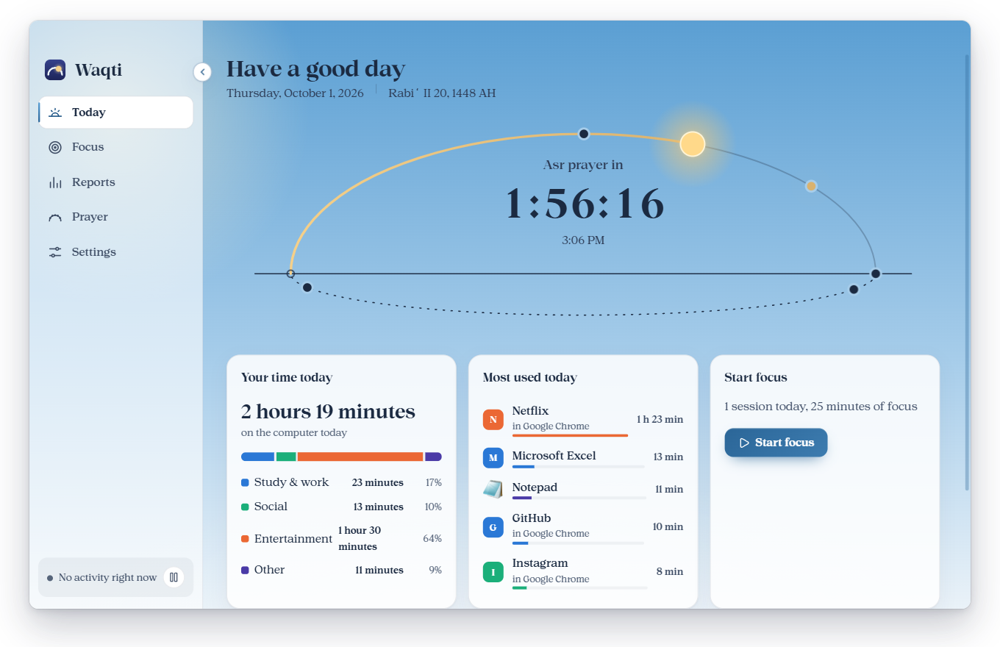

## Why I built it

Many of us spend the whole day at the computer, working or gaming, and a prayer comes and goes without us noticing; by evening we can't say where the time went. Waqti stays with you while you work: it tells you at the adhan, pauses everything at the iqama until you've prayed, shows you clearly where your day went, and helps you focus on what matters.

## What it does

- **Prayer first.** A small notice at the adhan tells you when the screen will lock. At the iqama a calm full-screen lock covers every display, pauses whatever video or audio is playing and mutes the sound until you're back. "I prayed" opens after a few minutes; there is one snooze and a press-and-hold emergency exit. Umm al-Qura times for 19 Saudi cities or any coordinates, a per-prayer delay and lock length (Jumu'ah has its own row), Ramadan iqama times, a notice before sunrise, no lock when you're away, and a delay during meetings (Teams, Zoom, Google Meet and others).
- **Know where your day went.** Apps and sites are tracked automatically and grouped into study & work, social and entertainment, with day/week/month reports and a comparison with the previous period. Fix a category once and all history follows.
- **Focus, guarded.** Set a length on a kitchen-timer dial and pick your distractions (YouTube, TikTok, any app, site or title keyword). Open one during a session and a gentle guard asks you to get back to work. A prayer that falls inside the session is announced up front, with a one-click length that ends at its adhan.
- **Colours that follow the sky**: blue by day, amber at Asr, rose at Maghrib, gold at night, down to the lock screen.
- **Private by design**: pause tracking, exclude apps, skip window titles, choose retention, export JSON/CSV or delete everything.

<table>
<tr>
<td width="50%">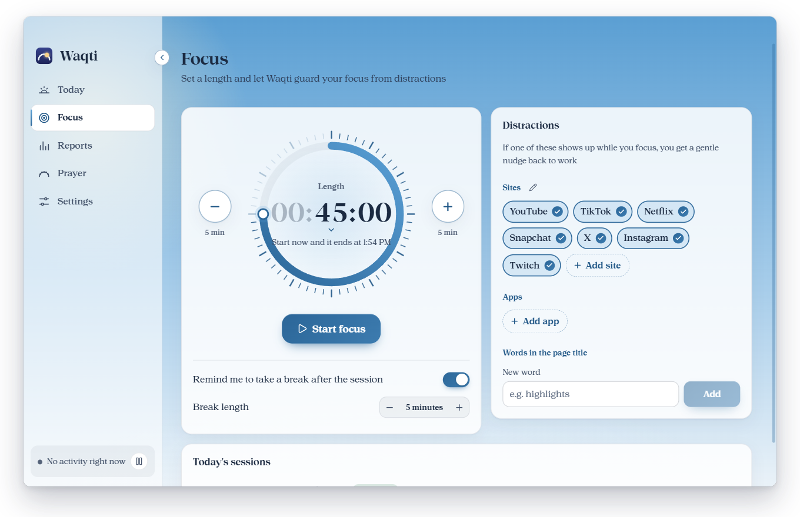</td>
<td width="50%">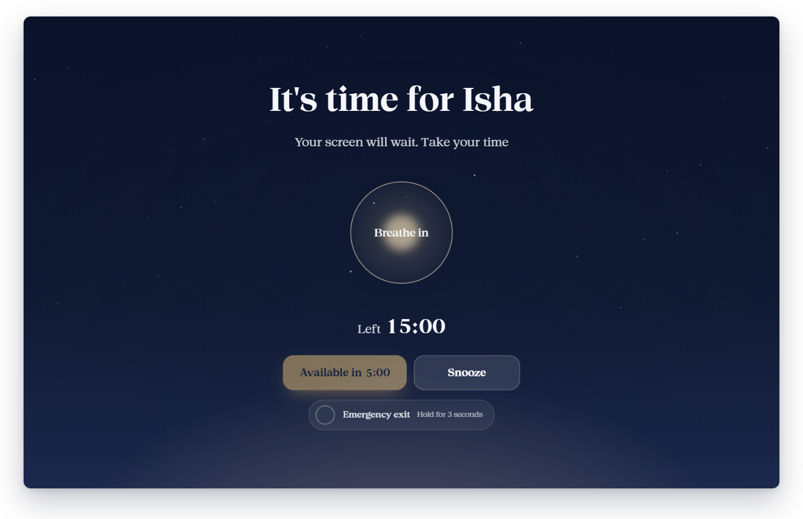</td>
</tr>
</table>

## Install

1. Download `Waqti-Setup.exe` from [Releases](https://github.com/Abdulaziz-J1/waqti/releases/latest) and run it. It asks for a language first.
2. It installs for your user only (no admin rights). The uninstaller asks whether to keep your data.

**Seeing a warning?** Waqti is new, free and not code-signed, so Windows, browsers and antivirus programs don't know it yet. A warning means "we haven't seen this before", not "we found something", and it fades as more people download it. Antivirus heuristics are also wary of new apps that watch the active window, lock the screen and pause media, which is exactly what Waqti does, all on your machine: it never connects to the internet.

- **Browser says the file "isn't commonly downloaded":** open Downloads (Ctrl+J), click ⋯ next to the file and choose **Keep** (in Edge, then **Show more** → **Keep anyway**).
- **"Windows protected your PC":** click **More info**, then **Run anyway**. It only appears once, at install.
- **Antivirus quarantined it:** restore it from the quarantine and add an exception (Avast/AVG: Menu → Quarantine → ⋯ → **Restore and add exception**; Windows Security: Virus & threat protection → Protection history → Actions → **Allow on device**), then run the installer again.
- **Avast/AVG stopped the installer itself** (it analyses it for about a minute, then ends it): Menu → Settings → General → Exceptions → **Add exception**, add `Waqti-Setup.exe` and the folder `%LOCALAPPDATA%\Programs\Waqti`, then run the installer.
- **Check the file:** run `Get-FileHash "$HOME\Downloads\Waqti-Setup.exe"` in PowerShell and compare it with the sha256 shown next to the file on the release page.

## Build from source

Electron, React and TypeScript, with SQLite for storage and [adhan](https://github.com/batoulapps/adhan-js) for prayer times. The lock and focus logic is a pure, fully tested state machine, and end-to-end tests drive the real app with Playwright. Requires Node.js ≥ 22.12 on Windows x64; no C++ toolchain.

```bash
npm install
npm run dev
```

The interface uses the thmanyah typeface, whose licence forbids redistributing the font files, so they are not in the repository: download the family from [font.thmanyah.com](https://font.thmanyah.com) into your Downloads folder and run `npm run fonts` once. Without it the app runs on the bundled fallback fonts, and `npm run dist` refuses to build the installer.

More in [ARCHITECTURE.md](ARCHITECTURE.md) (processes, the state machine with Mermaid diagrams, data model, measured performance), [DECISIONS.md](DECISIONS.md) (design decisions, in Arabic) and [TESTING.md](TESTING.md) (manual test checklist, in Arabic).

## Ideas and problems

Open an [issue](https://github.com/Abdulaziz-J1/waqti/issues/new/choose) (in English or Arabic), or from the app: Settings → About → "Suggest an idea" / "Report a problem".

## License

MIT — see [LICENSE](LICENSE). The interface fonts, Thmanyah Serif Display and Serif Text, are © thmanyah Publishing and Distribution and used under the [thmanyah Font License](https://font.thmanyah.com/licenses); they are embedded in the application and not licensed for extraction or redistribution. The fallback fonts (Noto Kufi Arabic, IBM Plex Sans Arabic) are under the SIL Open Font License 1.1; all third-party licences are in [THIRD_PARTY_LICENSES](THIRD_PARTY_LICENSES).
